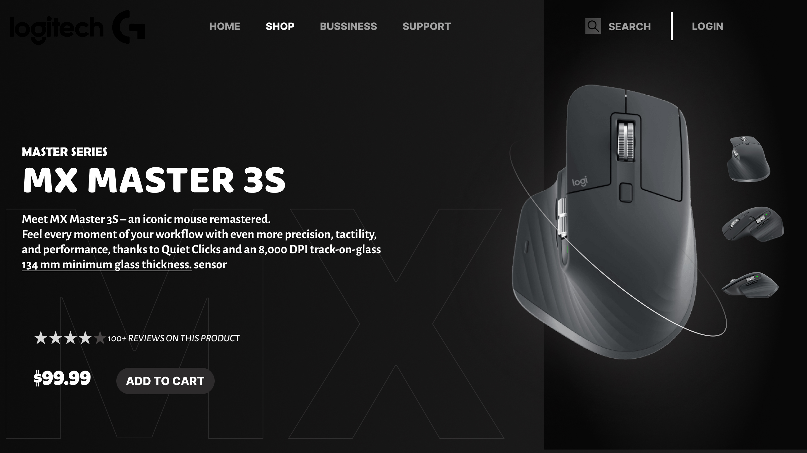

*Logitech Mouse UI Concept*

Description:
A UI concept for showcasing Logitech's latest mouse series with a premium, high-tech visual design.

Features:
1.Product spotlight design
2.Sleek, dark-themed UI
3.Engaging interactions

Technologies Used:
1.Figma

Usage:
Useful for e-commerce and tech product UI inspiration.

Author:
Subhro Ghosh

