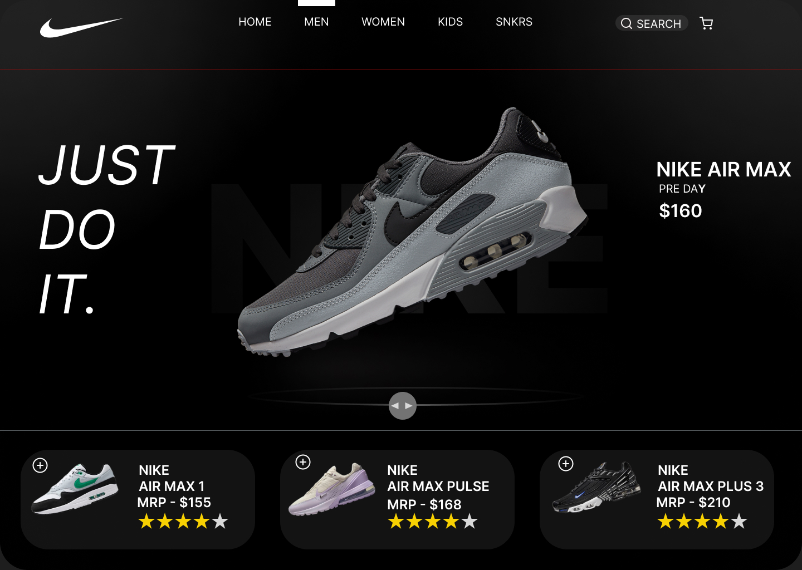

*Nike Concept UI*

Description:
A modern UI concept for Nike, blending dynamic visuals with engaging UI elements for a futuristic user experience.

Features:
1.Interactive product showcase
2.Dark theme with neon highlights
3.Smooth user experience

Technologies Used:
1.Figma

Usage:
Ideal for fashion brand UI prototypes and e-commerce platforms.

Author:
Subhro Ghosh

