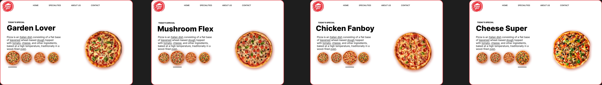

*Pizza UI Design*  

Description: 
A conceptual **UI/UX design** focused on a visually appealing and interactive pizza ordering experience. The design enhances user engagement through intuitive navigation, high-quality imagery, and a seamless selection process.  

Features:  
1.Modern and minimalistic UI design** for an elegant user experience.  
2.High-resolution pizza visuals** to enhance customer appeal.  
3.Interactive selection process** with smooth transitions.  

Technologies Used:  
1.Figma  

Usage: 
Ideal for showcasing **restaurant or food delivery UI concepts**, emphasizing user-friendly design and engaging product presentation.  

Author:
Subhro Ghosh

Prototype Link:
https://www.figma.com/proto/WUeJWXMVPpTdVwE4syhYgB/portfolio?page-id=33%3A2&node-id=33-3&p=f&viewport=136%2C382%2C0.13&t=lFWRzMZXzXgSxalT-1&scaling=scale-down&content-scaling=fixed&starting-point-node-id=33%3A3

